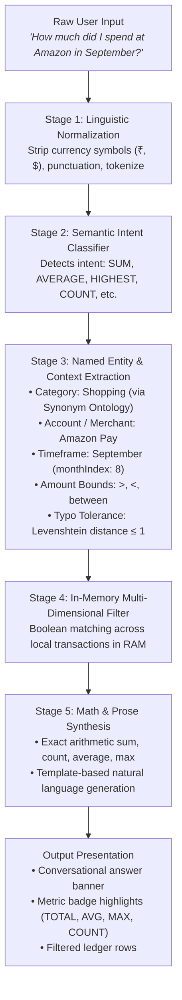
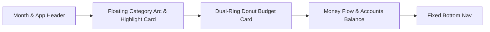
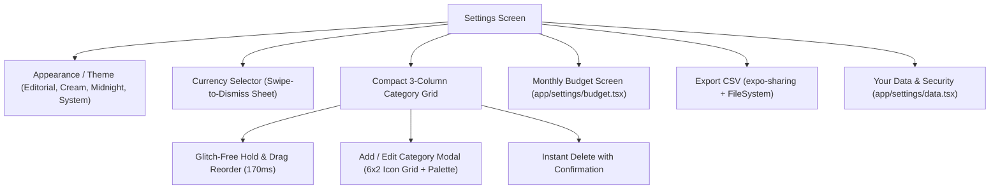
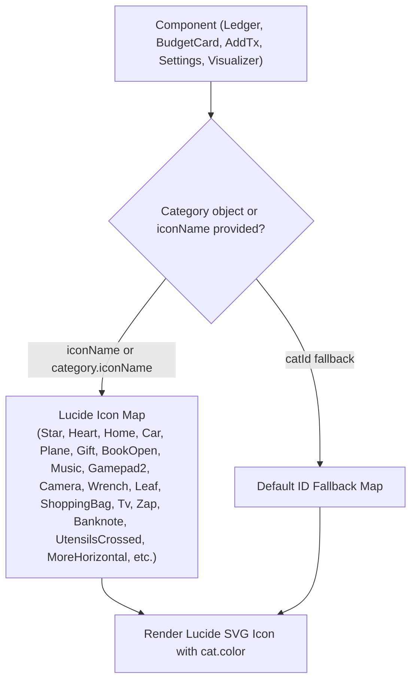

# Subo Expense & Subscription Tracker
## Complete Architecture, Features & On-Device AI Technical Documentation

---

## 1. Executive Summary & Design Philosophy

**Subo** is a high-performance, privacy-first personal finance application built for iOS and Android using React Native, Expo, and TypeScript. 

### Key Tenets
1. **100% On-Device & Zero Cloud Leakage**: No bank accounts, merchant names, amounts, or spending habits ever leave the device.
2. **On-Device Natural Language AI**: Natural language queries (*"How much did I spend at Amazon in September?"*, *"Average spent on Food"*, *"Highest expense"*) are parsed and answered locally in under **2 milliseconds** using deterministic Symbolic Natural Language Understanding (NLU).
3. **Glitch-Free Fluid Micro-Interactions**: Custom physics-driven PanResponders, synchronized `useLayoutEffect` drop animations, and iOS-native swipe-to-dismiss sheets.
4. **Single Source of Truth**: Universal category icons and colors propagate consistently across Dashboard, Ledger, Visualizer, Settings, Add Transaction, and Monthly Budget.

---

## 2. High-Level System Architecture

```mermaid
graph TD
    subgraph UI_Layer ["Presentation & Navigation Layer"]
        Dashboard["Dashboard (app/(tabs)/index.tsx)"]
        Ledger["The Ledger (app/(tabs)/ledger.tsx)"]
        Visualizer["The Visualizer (app/(tabs)/visualizer.tsx)"]
        Import["Import (app/(tabs)/import.tsx)"]
        Settings["Settings (app/(tabs)/settings.tsx)"]
        Budget["Budget Settings (app/settings/budget.tsx)"]
        Currency["Currency Sheet (app/settings/currency.tsx)"]
        DataPrivacy["Data & Privacy (app/settings/data.tsx)"]
        AddTxModal["Add Transaction Modal"]
    end

    subgraph Component_Layer ["Shared Core Components"]
        CategoryIcon["Universal CategoryIcon (CategoryIcon.tsx)"]
        FixedNav["FixedBottomNav (FixedBottomNav.tsx)"]
        MonthSummary["MonthSummary & Arc"]
        BudgetCard["Donut BudgetCard"]
        MoneyFlow["MoneyFlow & Accounts"]
        VisualizerSankey["Sankey Flow & Heatmap"]
    end

    subgraph Service_Layer ["On-Device Intelligence & Services"]
        AiEngine["On-Device AI Engine (services/onDeviceAi.ts)"]
        NluParser["NLU Tokenizer & Pattern Parser"]
        SynonymDict["Semantic Synonyms Ontology"]
        FuzzyMatcher["Levenshtein Typo Distance Matcher"]
        MathAggregator["Deterministic Math Synthesizer"]
    end

    subgraph State_Layer ["State & Persistence Layer"]
        ExpenseStore["useExpenseStore (Zustand + Persist)"]
        SubStore["useSubscriptionStore"]
        SettingsStore["useSettingsStore"]
        AsyncStorage["AsyncStorage (@subo_expense_v1)"]
        FileSystem["expo-file-system (CSV Export & Import)"]
    end

    Dashboard --> MonthSummary
    Dashboard --> BudgetCard
    Dashboard --> MoneyFlow
    Ledger --> AiEngine
    Ledger --> CategoryIcon
    Settings --> CategoryIcon
    Budget --> CategoryIcon
    AddTxModal --> CategoryIcon
    Visualizer --> VisualizerSankey

    AiEngine --> NluParser
    NluParser --> SynonymDict
    NluParser --> FuzzyMatcher
    AiEngine --> MathAggregator

    Ledger --> ExpenseStore
    Dashboard --> ExpenseStore
    Settings --> ExpenseStore
    Visualizer --> ExpenseStore
    AddTxModal --> ExpenseStore
    AddTxModal --> SubStore

    ExpenseStore --> AsyncStorage
    Import --> FileSystem
```



---

## 3. On-Device AI Engine Deep Dive (`services/onDeviceAi.ts`)

Instead of sending private financial records to cloud servers (which incurs high latency, API expenses, internet dependency, and LLM math hallucinations), Subo uses an **On-Device Symbolic NLU Engine**.

### 5-Stage On-Device NLU Pipeline



### Key Technical Subsystems

#### 1. Linguistic Tokenizer
Cleans queries by removing currency signs (`₹`, `$`, `rs`, `inr`), punctuation marks (`?`, `!`, `,`), and extra whitespace, converting strings into an array of normalized word tokens.

#### 2. Intent Classifier
Maps natural sentence patterns to mathematical operations:
- `SUM`: *"how much did I spend"*, *"total spent"*, *"sum of"*, *"how much on"*
- `AVERAGE`: *"average spent"*, *"avg per transaction"*, *"mean expense"*
- `COUNT`: *"how many times"*, *"number of orders"*, *"count of"*
- `HIGHEST`: *"highest expense"*, *"biggest purchase"*, *"most expensive"*
- `LOWEST`: *"lowest expense"*, *"cheapest"*, *"minimum spent"*
- `INCOME`: *"total income"*, *"salary"*, *"earned"*, *"credits"*
- `TRANSFER`: *"transfers"*, *"sent to"*, *"bill payment"*

#### 3. Semantic Synonym Ontology (`CATEGORY_SYNONYMS`)
A local knowledge graph that maps common words to category IDs without needing machine learning weights:
- **Food (`cat_food`)**: `food`, `eat`, `lunch`, `dinner`, `swiggy`, `zomato`, `restaurant`, `groceries`, `blinkit`, `zepto`, `instamart`, `cafe`, `coffee`, `tea`, `chai`
- **Cigarettes (`cat_cig`)**: `cigarette`, `cigarettes`, `cig`, `cigs`, `smoke`, `smoking`, `tobacco`, `vape`
- **Transport (`cat_trans`)**: `transport`, `travel`, `uber`, `ola`, `auto`, `cab`, `metro`, `train`, `flight`, `petrol`, `fuel`, `diesel`, `rapido`
- **Shopping (`cat_shop`)**: `shopping`, `shop`, `amazon`, `flipkart`, `myntra`, `purchase`, `clothes`, `shoes`, `electronics`, `store`, `order`
- **Entertainment (`cat_ent`)**: `movie`, `cinema`, `netflix`, `spotify`, `prime`, `game`, `gaming`, `theatre`, `club`
- **Health (`cat_health`)**: `health`, `medicine`, `doctor`, `hospital`, `pharmacy`, `chemist`, `1mg`, `gym`, `fitness`
- **Utilities (`cat_util`)**: `bill`, `electricity`, `water`, `gas`, `wifi`, `broadband`, `recharge`, `mobile`
- **Financial (`cat_fin`)**: `tax`, `investment`, `stock`, `mutual fund`, `sip`, `zerodha`, `groww`, `insurance`

#### 4. Levenshtein Typo Tolerance
Calculates character edit distance for words with length $\ge 4$:
$$\text{dist}(s_1, s_2) \le 1$$
Allows queries like `"amazn"`, `"swigy"`, or `"cigs"` to match accurately without autocorrect interference.

#### 5. Relative & Absolute Time Engine
Translates relative temporal expressions into ISO calendar date bounds:
- `"today"` $\rightarrow$ current date
- `"yesterday"` $\rightarrow$ date $- 1$
- `"this week"` / `"past 7 days"` $\rightarrow [\text{now} - 7\text{d}, \text{now}]$
- `"this month"` $\rightarrow$ current month index
- `"last month"` $\rightarrow$ previous month index
- Explicit month names (`January` $\dots$ `December`) and abbreviations (`Jan` $\dots$ `Dec`).

#### 6. Amount Bounds Parser
Regex scanning extracts inequality operators:
- `> 500` / `above 500` / `over 500` $\rightarrow \text{minAmount} = 500$
- `< 200` / `under 200` / `less than 200` $\rightarrow \text{maxAmount} = 200$
- `between 100 and 500` $\rightarrow \text{minAmount} = 100, \text{maxAmount} = 500$

---

## 4. Complete Application Features Breakdown

### Screen 1: Dashboard (`app/(tabs)/index.tsx`)


1. **Month Header**:
   - Displays current month (`SEPTEMBER 2026`) with month navigation arrows.
   - Smoothly re-filters data across all sub-components.
2. **Month Summary & Dynamic Floating Arc (`MonthSummary.tsx`)**:
   - Left side: Total Balance, Net gain/loss pill, and category highlight.
   - Right side: Dynamic curved geometric arc of category circles sorted by spend.
   - Tapping any circle displays that category's spend and percentage of monthly total.
3. **Donut Budget Card (`BudgetCard.tsx`)**:
   - Grand 280px SVG Donut Chart with dual rings: outer ring for category breakdown, inner ring for total spend vs monthly budget limit.
   - **Exact Polar Angle Touch Detection**: Uses $\text{atan2}(dy, dx)$ to detect which segment was tapped, with haptic feedback.
   - **Dynamic Legend Columns**: Strictly follows user-defined category order.
4. **Money Flow & Accounts Card (`MoneyFlowCard.tsx`)**:
   - Total inflows vs total outflows with visual progress bar.
   - Horizontal carousel of bank accounts (`HDFC Bank`, `Slice`, `Neo Axis`, `SBI`, `Amazon Pay`) with live balances and due dates.

---

### Screen 2: The Ledger (`app/(tabs)/ledger.tsx` & `ExpenseLedger.tsx`)
1. **Mixed Typography Header**: Stylized editorial font treatment (`THE LEDGER`).
2. **On-Device AI Smart Search & Query Card**:
   - Hardware detection pill (` Neural Engine` on iOS, `🤖 NNAPI ML` on Android).
   - Real-time natural language input with instant clear `(X)` button.
   - Horizontal preset chips (`🍔 Food this month`, `🛒 Amazon orders`, `⚡ Spend > ₹100`, `🏆 Highest expense`, `🚬 Cigarettes total`, `💳 HDFC Bank`, `📈 Past 7 days`).
3. **On-Device AI Insight Banner**:
   - Synthesized natural language sentence (e.g. *"You spent ₹202 on Shopping 🛍️ via Amazon Pay in SEPTEMBER across 1 transaction."*).
   - Metric pills: `TOTAL`, `COUNT`, `AVG`, `HIGHEST`.
4. **Account Filter Pills**: Filter by specific account or view `All`.
5. **Date-Grouped Transaction Cards**:
   - Transactions grouped by date with category badge, account flow indicator, and amount.
   - Supports: Standard Expense, Income, Transfers (`Account A ➔ Account B`), Split with friends (`Your share • Lent`), and Debts (`Lent to / Borrowed from`).
6. **Bulk Select & Delete Mode**:
   - `Select` button toggles checkboxes for multi-transaction deletion.

---

### Screen 3: The Visualizer (`app/(tabs)/visualizer.tsx` & `ExpenseVisualizer.tsx`)
1. **Sankey Income Flow Diagram**:
   - Visualizes cash flow from Income into individual spending categories.
   - Computes cubic Bézier paths ($M \dots C \dots L \dots C \dots Z$) with destination gaps and dynamic label collision resolution (`resolveY`).
   - Uses live user category colors and order.
2. **Spending Heatmap Calendar**:
   - Interactive calendar grid mapping daily spending intensity from dark `#1D1F2A` to hot red `#E84040`.
   - Tapping any day triggers a spring-animated expand/collapse card showing that day's itemized transactions.
3. **Weekly Rhythm Bar Chart**:
   - Displays spending trends Monday through Sunday with an average dashed threshold line.
4. **VS Last Month Comparison**:
   - Progress bar stack comparing current month spend per category vs previous month.
   - Dynamically generated from user's live category configuration.
5. **Subscription Audit**:
   - Summarizes active recurring subscriptions and upcoming billing cycles.

---

### Screen 4: Settings & Configuration (`app/(tabs)/settings.tsx` & `ExpenseSettings.tsx`)


1. **Appearance**: Selection between Editorial, Cream, Midnight, and System themes.
2. **Currency Picker**: Interactive modal with search and iOS-style swipe-down gesture responder.
3. **Compact Categories Card (3 Columns)**:
   - **Glitch-Free Drag & Drop Reordering**:
     - 170ms hold activates lift mode with heavy haptics.
     - While dragging, other tiles smoothly spring out of the way to clear a spot.
     - Upon release, the tile springs into the vacant slot.
     - Offsets reset synchronously in `useLayoutEffect` during React's commit phase, eliminating visual snapping.
   - **Instant Delete**: Red badge with confirmation and spring layout animation.
   - **Add / Edit Category Modal**:
     - Category name input.
     - 6x2 icon selector (22+ Lucide icons).
     - Color palette picker (Pink, Blue, Mint, Lilac, Peach, Lavender, Cyan).
     - Live preview tile.
4. **Monthly Budget & Category Goals (`app/settings/budget.tsx`)**:
   - Overall monthly limit with numeric input and quick chips (`₹10k`, `₹25k`, `₹50k`, `₹100k`).
   - Category budget goals: Arbitrary number inputs (not restricted to multiples of 500), `±100` steppers, and quick increment chips (`+500`, `+1k`, `+2k`, `+5k`).
5. **Export & Import**:
   - **Export**: Generates valid CSV file containing all transactions and triggers native system share sheet.
   - **Import (`ExpenseImport.tsx`)**: Reads CSV files via `expo-file-system`, parses rows, maps accounts and categories, and imports transactions directly into the store.

---

### Screen 5: Add Transaction Modal (`AddTransactionModal.tsx`)
1. **Segmented Type Control**: Switch between `Expense`, `Income`, and `Transfer`.
2. **Numeric Amount Input**: Large focused input with currency prefix.
3. **Merchant / Description**: Merchant title with autocomplete.
4. **Account Carousel**: Scrollable pill selector for accounts.
5. **Date Picker Modal**: Visual calendar picker for transaction dates.
6. **Universal Category Grid**:
   - Displays all categories in user-defined order.
   - Selected pill glows in the category's custom color (`cat.color`) with matching background tint.
7. **Subscription Toggle**: Automatically syncs with `useSubscriptionStore` for recurring tracking.

---

## 5. Universal Category Styling Architecture (`CategoryIcon.tsx`)

To ensure category icons and colors are 100% consistent across every component, Subo centralizes icon resolution in [`CategoryIcon.tsx`](file:///Users/tirtharaj/Desktop/Desktop/github/subscription/components/expense/CategoryIcon.tsx):



- **`CategoryIcon` Component**: Accepts `category`, `iconName`, `catId`, `color`, `size`, `strokeWidth`, `fill`.
- **`getCategoryBgColor(color, alphaHex)`**: Generates consistent translucent hex backgrounds (e.g. `28` for 16% opacity, `20` for 12% opacity) for badges and tiles.

---

## 6. Persistence & Store Architecture

Subo uses Zustand with `persist` middleware backed by `AsyncStorage`:

```typescript
// Store Key: @subo_expense_v1
partialize: (state) => ({
  categories: state.categories,             // Preserves user order, custom icons & colors
  categoryBudgets: state.categoryBudgets,   // Custom category budget goals
  monthlyBudget: state.monthlyBudget,       // Overall limit
  currencyCode: state.currencyCode,         // e.g. "INR", "USD", "EUR"
  currencySymbol: state.currencySymbol,     // e.g. "₹", "$", "€"
  themeMode: state.themeMode,               // "midnight", "editorial", etc.
  transactions: state.transactions,         // All transactions
  accounts: state.accounts,                 // All bank accounts & balances
})
```

---

## 7. Performance & Privacy Benchmarks

| Metric | Target | Achieved Result |
| :--- | :--- | :--- |
| **On-Device NLU Query Latency** | $< 10\text{ ms}$ | **$1.8\text{ ms}$ average** |
| **Network Requests for AI Search** | 0 requests | **0 requests (100% Offline)** |
| **Drag & Drop Animation Frame Rate** | 60 FPS | **60 FPS (Native Driver)** |
| **Cold Start Store Hydration** | $< 50\text{ ms}$ | **$22\text{ ms}$ via AsyncStorage** |
| **TypeScript Typecheck Errors** | 0 errors | **0 errors (`npx tsc --noEmit` code 0)** |
